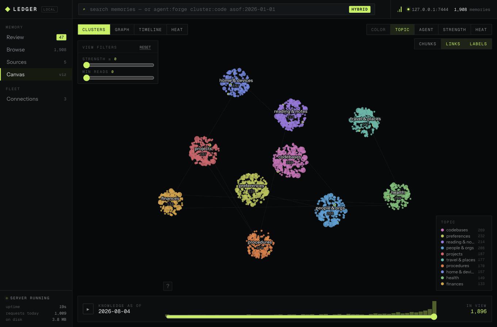
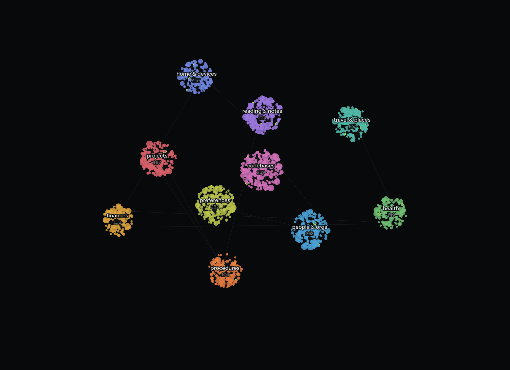
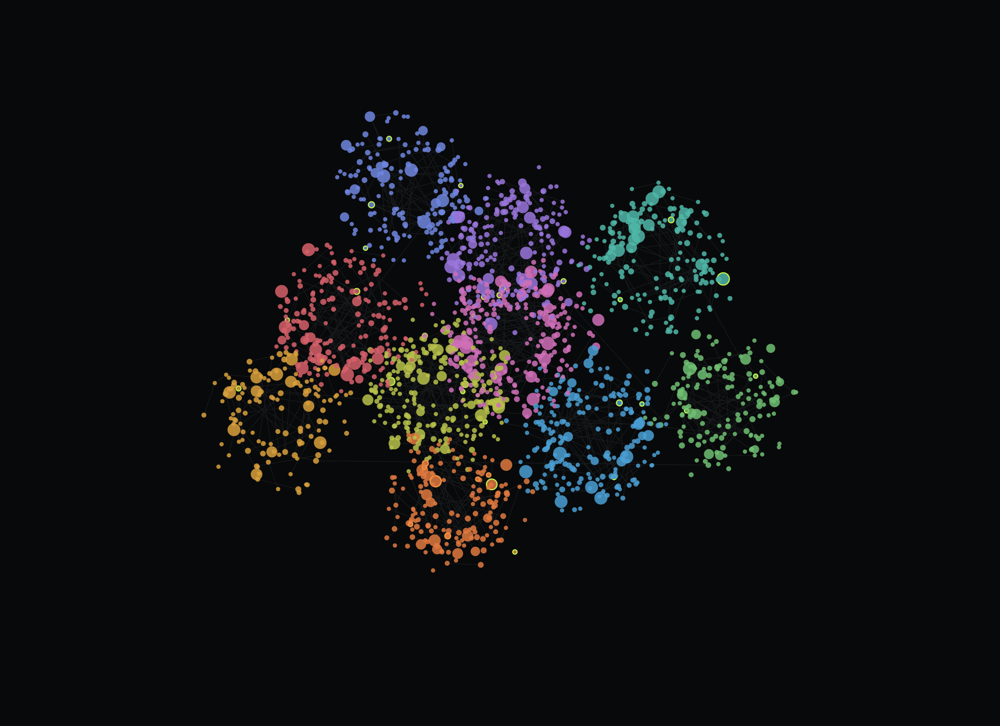
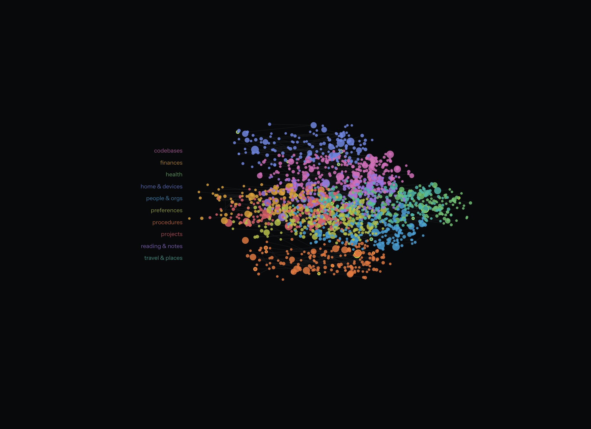
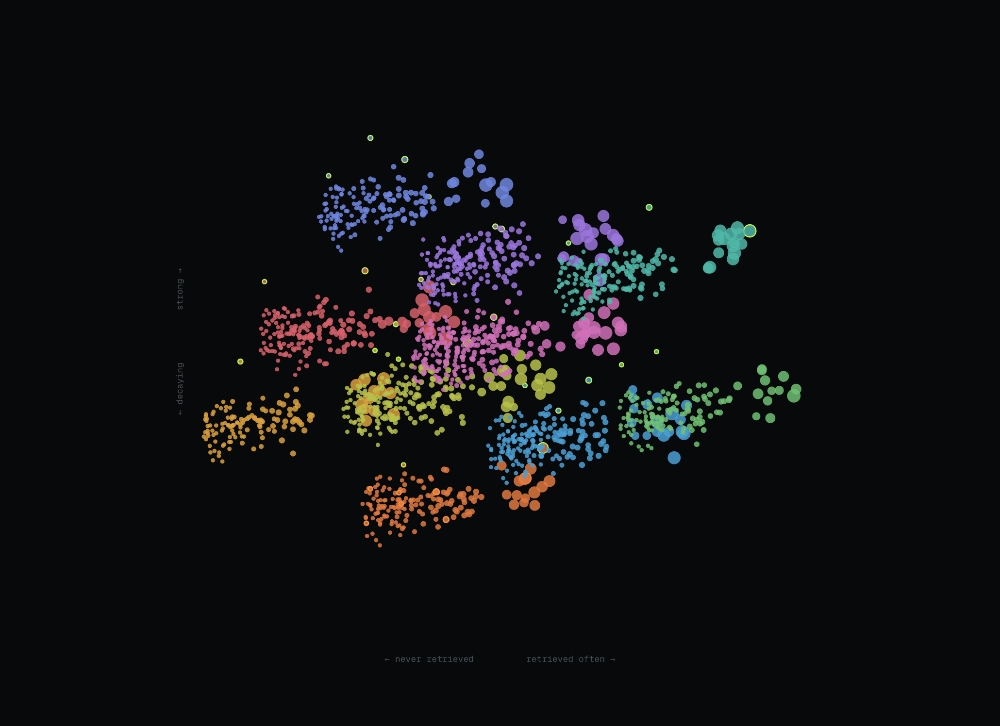

<div align="center">

# ◆ &nbsp;LEDGER

**Local memory for a fleet of agents, with a human in the loop.**

Agents remember things across sessions. You see everything they remember.
Nothing leaves the machine.

[Documentation](https://kucukkanat.github.io/ledger-memory/) &nbsp;·&nbsp;
[Install](#install) &nbsp;·&nbsp;
[How it works](#the-three-ideas) &nbsp;·&nbsp;
[CLI](#the-cli)

`skill` &nbsp;•&nbsp; `bun` &nbsp;•&nbsp; `sqlite + fts5` &nbsp;•&nbsp; `no network` &nbsp;•&nbsp; `178 tests`

</div>

<br>



<br>

## What it is

LEDGER is a **skill**. Installing it gives an agent a bundled CLI it shells out
to — `ledger remember`, `ledger recall` — backed by a SQLite file on your disk.
It also gives you a supervision UI, so the memory your agents accumulate is
something you can read, correct and throw out rather than something that
silently grows.

There is no server to keep running and no network protocol. Agents open the file
directly.

## Install

```bash
npx skills add kucukkanat/ledger-memory        # this project
npx skills add kucukkanat/ledger-memory -g     # every project
```

That copies three things into `.claude/skills/ledger-memory/`: `SKILL.md`, a
single bundled `cli.js`, and the supervision UI. No install step, no
dependencies to fetch. It does need [Bun](https://bun.sh).

Then, whenever you want to look at what your agents have learned:

```bash
bun ~/.claude/skills/ledger-memory/cli.js serve   # http://127.0.0.1:7444
```

<br>

## The three ideas

Most agent memory is a bag of strings that only grows. Three distinctions keep
LEDGER useful past a few hundred entries.

### 1 · Claims decay. Chunks do not.

A **claim** is an assertion — *"Brightpath invoices net-45"*. A **chunk** is a
slice of an ingested document.

Claims are reviewed one at a time and lose strength when nothing reads them.
Chunks are trusted or dropped *whole with their source*, inherit its trust
verbatim, and never decay. Nobody can review ten thousand chunks, so LEDGER
never asks you to.

### 2 · Strength is computed, never stored.

```
strength = 0.17 + 0.27·used + 0.34·fresh + 0.22·corroborated
```

`used` is log-scaled retrieval count. `fresh` decays exponentially with a
190-day time constant on last read. `corroborated` counts independent sources
and distinct agents. It is recalculated on every read, so the number can never
drift away from the evidence that justifies it. Pinning opts a claim out of
decay entirely.

This is why the CLI has both `recall` and `search`. **`recall` is the agent's
verb and counts as a retrieval; `search` is yours and does not.** They run the
identical query. They are separate verbs rather than one command with a flag
because a flag would eventually be passed wrongly — and that failure is silent,
and it quietly corrupts every score in the store.

### 3 · The store proposes conflicts. Agents judge. You resolve.

Deciding that *"prefers trains under five hours"* contradicts *"now flies
anything over three hours"* is a judgement about meaning, and a lexical rule
that tries to make it will be confidently wrong.

So the store only narrows millions of pairs down to a handful worth a look —
same subject, divergent numbers, dates, or a negation on one side. An agent
returns the verdict. Choosing which memory survives stays yours: there is no
`resolve` command in the agent's half of the CLI, deliberately.

<br>

## What an agent does

```bash
ledger recall "invoice terms brightpath"
```
```
2 memories
m_msdvpyg9lkdujq   84  Brightpath invoices net-45 in the 2026 contract  [money]
m_msdvpyi6f2x7zr   51  Brightpath pays late by about nine days  [money]
```

```bash
ledger remember "Brightpath moved to net-45 in the 2026 contract" \
  --cluster money --note "confirmed by follow-up question"

ledger conflicts
ledger judge cc_msdvpyi8r1tj4u --verdict conflict --kind "stale terms" --detector 0.9
```

The full agent-facing contract is
[`skills/ledger-memory/SKILL.md`](skills/ledger-memory/SKILL.md) — that file
*is* the interface.

## What you do

```bash
ledger serve      # Review · Browse · Sources · Canvas · Connections
ledger review     # the same queue, keyboard-driven, in the terminal
ledger search "cluster:code strength:>70"
ledger stats
```

<br>

## Four ways to look at the same memories

<table>
<tr>
<td width="50%"></td>
<td width="50%"></td>
</tr>
<tr>
<td><b>Clusters</b> — what the fleet knows, by topic.</td>
<td><b>Graph</b> — how memories link to each other.</td>
</tr>
<tr>
<td></td>
<td></td>
</tr>
<tr>
<td><b>Timeline</b> — how knowledge accumulated, banded by topic.</td>
<td><b>Heat</b> — retrieval against strength. Top right is load-bearing; bottom left is dead weight.</td>
</tr>
</table>

<br>

## The CLI

| For agents | |
| --- | --- |
| `recall <query>` | search — **counts as a retrieval** |
| `remember <text> --cluster <id>` | write one memory |
| `forget <id...>` | drop memories (still answerable by `asof:`) |
| `link <a> <b>` | record that two memories are related |
| `clusters` | the topic taxonomy |
| `conflicts` | pairs the store wants judged |
| `judge <candidate> --verdict …` | return a verdict |
| `ingest <file>` | store a document as searchable chunks |

| For you | |
| --- | --- |
| `serve` | the supervision UI |
| `review` | work the queue in the terminal |
| `search <query>` | search — **does not count** |
| `resolve <id> a\|b\|both\|merge\|dismiss` | settle a conflict |
| `sources` · `stats` · `export` | inspect and extract |

### Query language

Free text plus filters, identical in the CLI and the UI search box:

```
agent:forge          written or read by that agent
cluster:code         topic cluster
type:chat|doc        said in conversation, or from a document
kind:claim|chunk     assertions, or document slices
strength:<40         fading            (also strength:>70)
asof:2026-01-01      what the store knew then, dropped memories included
after:30d            also 2w, 6mo, 1y, or an absolute date
before:2026-06-01
```

`asof:` is the one worth remembering. Deletes are soft, so it answers *what did
we believe back then* — including memories dropped since, and including
full-text queries.

<br>

## Development

```bash
bun install
bun run --filter '@ledger/ui' fonts:vendor   # once — self-hosts the typefaces
bun run build:skill                          # bundle into skills/ledger-memory/
bun run demo                                 # a store with 1,908 memories to look at

bun test          # 151 unit + integration
bun run test:e2e  # 27 end-to-end, spawning the real bundle
```

`packages/*` is the source of truth. `skills/ledger-memory/` is build output and
**is committed**, because `skills add` copies files and never runs a build.

| Package | |
| --- | --- |
| [`@ledger/core`](packages/core) | The store. SQLite + FTS5, strength, query language, conflict candidates, ingestion. |
| [`@ledger/cli`](packages/cli) | Everything an agent and a human can do. Bundles to `cli.js`. |
| [`@ledger/server`](packages/server) | Loopback HTTP for the supervision UI. |
| [`@ledger/ui`](packages/ui) | Review, Browse, Sources, Canvas, Connections. |
| [`@ledger/tokens`](packages/tokens) | Design tokens, shared by the UI and the CLI's ANSI output. |

Nothing is mocked. The unit suite runs against real SQLite with an injectable
clock, which is how decay is tested deterministically; the e2e suite spawns the
actual bundled `cli.js` as a subprocess, so a stale or broken build fails rather
than ships.

<br>

## Honest limitations

- **Bun is required.** The bundle uses `bun:sqlite`. There is no Node fallback.
- **No embeddings.** Search is BM25 over FTS5, widened with character-level
  fuzz. It will miss a paraphrase that shares no words.
- **Identity is self-declared.** `--agent` is attribution, not authorisation.
  The per-agent scopes on the Connections screen are documentation; they are not
  enforced, and the store is a file on your disk with one owner.
- **Conflict detection is lexical.** It proposes candidates by overlapping
  subjects and divergent numbers, dates or negation. It will miss a
  contradiction phrased entirely differently, which is exactly why an agent
  judges rather than the store deciding.
- **Ranking is bounded.** Strength is a function of the current time and cannot
  be sorted in SQL, so ranking happens over a window of 5,000 rows. When the
  window fills, results say so rather than pretending to be complete.

<br>

<div align="center">

MIT · Built with [Claude Code](https://claude.com/claude-code)

</div>
